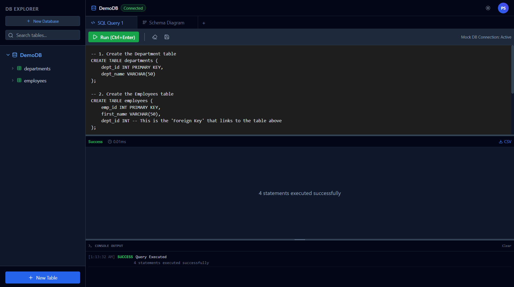
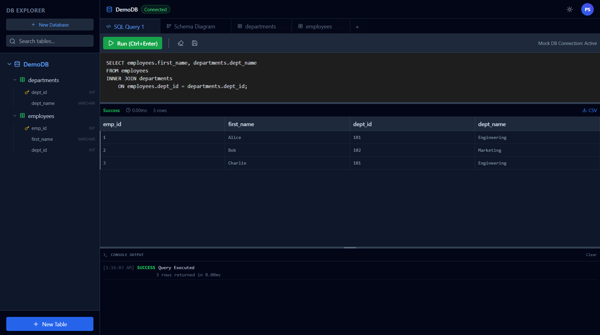
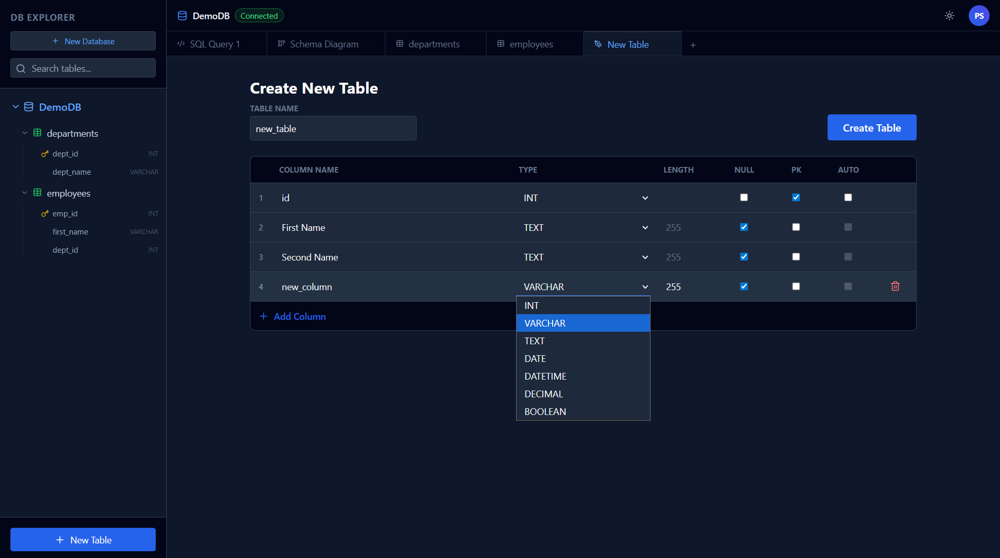
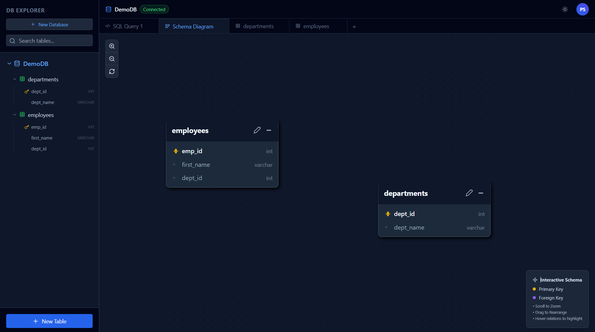

# RDBMS Challenge - A Custom Database from Scratch

Hey there! 👋 This is my take on the RDBMS challenge - building a complete relational database management system from the ground up. I created both a sleek React frontend for managing databases and a robust Python backend that handles all the database operations.

What makes this special? I built the core database engine using only Python's standard library - no external database libraries at all. It's a full implementation that supports tables, relationships, SQL queries, and even basic indexing.

## 🎯 What This Project Shows

This is my implementation of a complete RDBMS from scratch. I built it to demonstrate deep understanding of database systems, SQL processing, and full-stack development. Here's what I tackled:

- **Core Database Engine**: Built entirely with Python's standard library - no external DB dependencies
- **SQL Parser & Executor**: Manual implementation of SQL query processing (SELECT, INSERT, JOINs, etc.)
- **Web Interface**: Clean React frontend for database management
- **REST API**: FastAPI backend serving database operations

The challenge was to create something functional yet educational, showing real database concepts without overcomplicating things.

## ✨ What I Built

**Database Engine** (Python/FastAPI):
- In-memory RDBMS using only Python standard library
- Full SQL support: SELECT, INSERT, JOIN, WHERE, etc.
- Tables with primary/foreign keys and basic indexing
- Manual SQL parsing and execution planning

**Web Interface** (React/TypeScript):
- SQL query editor with live execution
- Table designer and data viewer
- Schema visualization of relationships

**Demo**: Pre-loaded with departments, employees, and projects tables to showcase relationships and queries.

## 📸 Screenshots

### Main Interface


### SQL Query Editor


### Table Schema Designer


### Schema Visualization


## 🚀 Getting Started

**Prerequisites**: Python 3.11+, Node.js 18+

1. **Install dependencies**:
   ```bash
   # Frontend
   cd frontend && npm install

   # Backend
   cd backend && pip install -r requirements.txt
   ```

2. **Start the services**:
   ```bash
   # Terminal 1: Backend
   cd backend && python -m app.main

   # Terminal 2: Frontend
   cd frontend && npm run dev
   ```

3. **Open** `http://localhost:3000` in your browser!

The app comes pre-loaded with demo data - try some SQL queries like `SELECT * FROM employees JOIN departments ON employees.department_id = departments.id;`

## 📖 Usage Guide

### Getting Started
1. **Database Overview**: The main interface shows the current database with available tables
2. **SQL Queries**: Click "SQL Query" tab or use the sidebar to start writing queries
3. **Table Management**: Use "New Table" to design custom table schemas
4. **Data Exploration**: Click on table names in the sidebar to browse data

### SQL Query Examples

#### Basic SELECT Queries
```sql
-- View all employees
SELECT * FROM employees;

-- Filter by department
SELECT * FROM employees WHERE department_id = 1;

-- Limit results
SELECT * FROM employees LIMIT 3;
```

#### JOIN Operations
```sql
-- Employees with department names
SELECT e.name, e.role, d.name as department
FROM employees e
JOIN departments d ON e.department_id = d.id;

-- Projects with budgets over 50k
SELECT p.name, p.budget
FROM projects p
WHERE p.budget > 50000;
```

#### Data Modification
```sql
-- Insert new employee
INSERT INTO employees (name, role, department_id, salary)
VALUES ('Jane Smith', 'Designer', 4, 75000);

-- Update existing record
UPDATE employees
SET salary = salary * 1.1
WHERE role = 'Engineer';

-- Delete record
DELETE FROM employees WHERE id = 106;
```

### Table Design
1. Click "New Table" in the sidebar
2. Define table name and columns:
   - **Column Name**: Identifier for the column
   - **Type**: Data type (INT, VARCHAR, DECIMAL, etc.)
   - **Length**: Size constraint for VARCHAR columns
   - **Nullable**: Whether the column can contain NULL values
   - **PK**: Primary key designation
3. Add/remove columns as needed
4. Save the table schema

### Schema Visualization
- Click "Schema Diagram" tab to view database relationships
- Interactive diagram shows tables and their connections
- Click table nodes to edit schemas
- Visual representation of foreign key relationships

## 💡 Skills Demonstrated

This project showcases expertise in:

- **Database Systems**: Relational model, SQL parsing, query execution, indexing
- **Backend Development**: Python, FastAPI, REST APIs, data validation
- **Frontend Development**: React, TypeScript, modern web development
- **System Design**: Building complex systems from scratch with standard libraries
- **Problem Solving**: Implementing database concepts without external dependencies

Built for a job interview challenge - clean, functional, and demonstrates real engineering skills! 🚀

## 📄 Data Storage Explanation

### `backend/rdbms_storage.json`

This JSON file serves as the persistent storage mechanism for the custom RDBMS implementation. It contains the complete state of all databases, including their schemas, table structures, and data rows. The file is loaded into memory when the backend starts and is saved back to disk whenever changes are made.

**Key Structure:**
- **Databases**: Top-level object containing all databases (e.g., "DemoDB")
- **Tables**: Each database contains an array of table objects with:
  - `id`: Unique table identifier
  - `name`: Human-readable table name
  - `columns`: Array of column definitions including type, constraints, and properties
  - `rows`: Array of data rows as key-value objects
  - `indexes`: Index definitions for performance optimization

**Example Usage:**
The file includes a pre-populated "DemoDB" with sample tables like `departments` and `employees`, demonstrating relationships and data types. This allows users to immediately explore the system with meaningful data without manual setup.

The storage format ensures data persistence across application restarts while maintaining a simple, human-readable JSON structure.


## Credits and Attribution

This project was developed with the assistance of AI, guided by professional prompting with programming principles and best practices in mind.

*   **Frontend:** The user interface and frontend components were developed with the help of Google's AI model **Gemini 3 Flash Preview**, accessed via Google AI Studio.
*   **Backend:** The backend logic was manually coded with the assistance of the AI model **`X-ai/grok-code-fast-1`** in my VS Code IDE.
